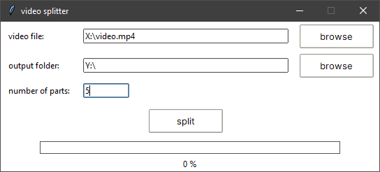

# vid splitter

a minimalist python gui tool that splits video files into equal segments.

## functionality

  * splits mp4 video files into a user-defined number of equal parts.
  * provides a gui for ease of use.
  * supports persistent configuration for last-used paths.
  * uses multithreading to keep the ui responsive during splitting.
  * includes a progress indicator.

## usage

1.  **dependencies:** ensure python 3, `tkinter`, and `moviepy` (requires `ffmpeg`) are installed.
      * `pip install moviepy`
      * install `ffmpeg` (see moviepy documentation).
2.  **run:** `python vid_splitter.py`
3.  select your video, define parts, choose output, then click "split".

## screenshot

